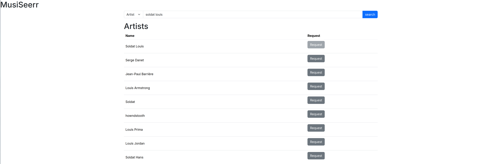

# MusiSeerr

> ⚠ This application is still in beta and under development

MusiSeerr allows any user to request for an artist/album/music to be added automatically to lidarr.

Automate your music monitoring without giving users permissions over lidarr.

This is an attempt to create a JellySeer / Overseer but for music.




## Run on your server
See the [docker compose file](./compose.yml). Don't forget to setup your lidarr api key.

```sh
docker compose up -d
```